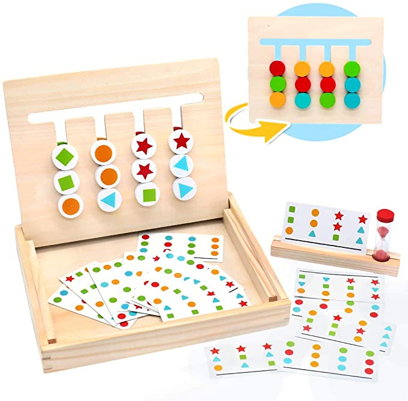
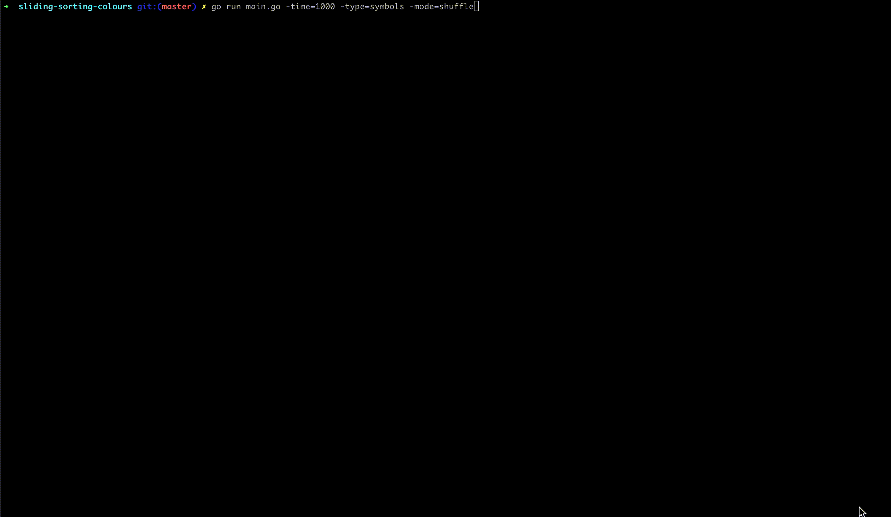

# Sliding Sorting Colours Game

Taking inspiration from this game my son has got :)

[](https://www.amazon.com/Montessori-Matching-Preschool-Education-Recognition/dp/B07R7Q6SD8)

## Help

```shell
$ go run main.go --help
Usage of ./main:
  -mode string
    	Gaming mode (shuffle or input). Default: shuffle (default "shuffle")
  -time int
    	Drawing Speed. Default: 10ms (default 10)
  -type string
    	Type of drawing (letters, circles, symbols). Default: circles (default "circles")
```

## Run

```shell
$ go run main.go -time=1000 -type=symbols -mode=shuffle
SLIDING SORTING COLOURS
---
Starting Board
[ ] [ ] [ ] [ ] [ ] [ ] [ ]
   [●]   [▲]   [■]   [●]
   [■]   [●]   [★]   [★]
   [★]   [▲]   [■]   [▲]
---
Desired Board
[ ] [ ] [ ] [ ] [ ] [ ] [ ]
   [■]   [●]   [▲]   [●]
   [★]   [★]   [▲]   [●]
   [▲]   [■]   [■]   [★]
--- STEP #28..
[ ] [ ] [ ] [ ] [ ] [ ] [ ]
   [■]   [●]   [▲]   [●]
   [★]   [★]   [▲]   [●]
   [▲]   [■]   [■]   [★]
```


